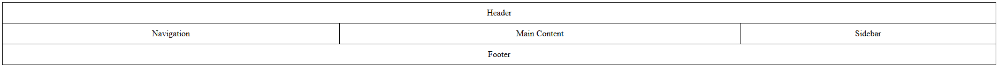
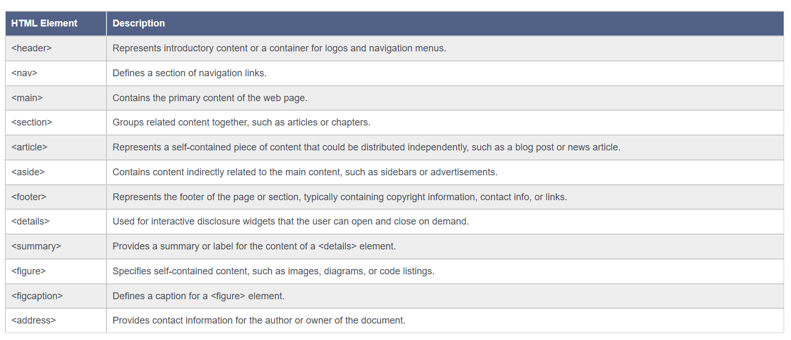

# HTML Layout
HTML layout refers to arranging and positioning elements on a web page. It involves structuring content, defining the page’s visual organization, and ensuring a user-friendly experience. HTML layouts can be created using various methods and technologies, including tables, divs, and modern CSS layout techniques.

## Table-Based Layout
In the past, table-based layout was a common method for designing web page layouts. It uses HTML tables to organize content into rows and columns. However, this method is now outdated and discouraged in favor of more modern and flexible CSS layout techniques.

Example:
```html
<html>
<head>
  <style>
    table { width: 100%; border-collapse: collapse;}
    td { border: 1px solid black; padding: 10px; text-align: center;}
  </style>
</head>
<body>
<table>
  <tr>
    <td colspan="3">Header</td>
  </tr>
  <tr>
    <td>Navigation</td>
    <td>Main Content</td>
    <td>Sidebar</td>
  </tr>
  <tr>
    <td colspan="3">Footer</td>
  </tr>
</table>
</body>
</html>
```
Output:



In this example:
```html
⦁ CSS Styling (<style> in <head>):
⦁ #table: Sets the table width to 100% of its container and collapses borders between table cells.
⦁ #td: Styles table cells with a 1px solid black border, 10px padding, and centers text horizontally within each cell.
⦁ HTML Structure (<body>):
⦁ <table>: Defines the main table structure for the webpage layout.
⦁ <tr> (Table Row): Represents each row in the table.
⦁ <td> (Table Data): Represents each cell within the table row.
⦁ colspan=”3″: Spans the cell across three columns, merging them into a single cell.
⦁ The content inside each <td> represents different sections:
⦁ Header: Spanning all three columns (colspan=”3″).
⦁ Navigation, Main Content, Sidebar: Each in its own column.
⦁ Footer: Spanning all three columns (colspan=”3″).
```

Notes:
```html
⦁ Table Structure for Layout: While tables were historically used for layout purposes in HTML, it’s generally recommended to use semantic HTML elements like <header>, <nav>, <main>, <aside>, and <footer> combined with CSS for layout purposes.
⦁ Accessibility: If using tables, ensure the layout makes sense when linearized (read from top to bottom), especially for screen readers and other assistive technologies.
```

## Div-Based Layout
The div-based layout is a more modern and flexible approach that uses ```<div>``` elements to structure web page content. This method offers better control over positioning and styling through CSS.

Example:
```html
<!DOCTYPE html>
<html>
<head>
    <title>HTML Layout</title>
    <style>
        #header, #footer { background-color: #333; color: white; padding: 10px; }
        #nav, #sidebar { background-color: #f0f0f0; padding: 10px; }
        #content { padding: 20px; } 
    </style>
</head>
<body>
    <div id="header">Header</div>
    <div id="nav">Navigation</div>
    <div id="content">Main Content</div>
    <div id="sidebar">Sidebar</div>
    <div id="footer">Footer</div>
</body>
</html>
```
Output:
<!DOCTYPE html>
<html>
<head>
    <title>HTML Layout</title>
    <style>
        #header, #footer { background-color: #333; color: white; padding: 10px; }
        #nav, #sidebar { background-color: #f0f0f0; padding: 10px; }
        #content { padding: 20px; } 
    </style>
</head>
<body>
    <div id="header">Header</div>
    <div id="nav">Navigation</div>
    <div id="content">Main Content</div>
    <div id="sidebar">Sidebar</div>
    <div id="footer">Footer</div>
</body>
</html>
<br>

```html
In this example:
⦁ CSS Styling (<style> in <head>):
⦁ Each id selector (#header, #nav, #content, #sidebar, #footer) targets specific <div> elements based on their unique IDs.
⦁ #header, #footer: Styled with a dark background color (#333), white text color, and padding of 10px.
⦁ #nav, #sidebar: Styled with a light background color (#f0f0f0) and padding of 10px.
⦁ #content: Styled with padding of 20px.
⦁ HTML Structure (<body>):
⦁ <div id=”header”>: Represents the header section with a dark background and white text.
⦁ <div id=”nav”>: Represents the navigation section with a light background.
⦁ <div id=”content”>: Represents the main content section with padding.
⦁ <div id=”sidebar”>: Represents the sidebar section with a light background.
⦁ <div id=”footer”>: Represents the footer section with a dark background and white text.
```
## Structural Elements
HTML provides several structural elements to define the layout and organization of content on a web page. These elements help create a clear, semantic structure that is both human-readable and machine-readable.


Here is a table of the most common structural elements:


Examples of Structural Elements in Use
```html
<!DOCTYPE html>
<html>
<head>
    <style>
        body { font-family: Arial, sans-serif; margin: 0; padding: 0; font-size:20px;}
        header { background-color: #8569ff; padding: 20px;}
        nav{ background-color: #a08bff; padding: 20px;}
        nav ul { list-style-type: none; padding: 0; text-align:center; }
        a{color:black; font-size: 20px; text-decoration: none; }
        nav li a{ text-transform: uppercase; padding: 0 10px;}
        nav li { display: inline; margin-right: 10px; }
        main { background-color: #b6ade0; padding:35px;}
        section{background-color: #b2a0ff; padding: 20px;}
        article{background-color: #a18cff; margin-top:20px; padding: 20px;}
        aside { background-color: #645b8e; padding: 20px;}
        footer { background-color: #795bff; text-align: center; font-size: 20px; padding: 20px;}
    </style>
</head>
<body>
    <header>
        <nav>
           <ul>
                <li><a href="#home">Home</a></li>
                <li><a href="#about">About</a></li>
                <li><a href="#contact">Contact</a></li>
            </ul>
        </nav>
    </header>
    <main>
        <section id="home">
            <h2>Home</h2>
            <p>Welcome to our website!</p>
        </section>
        <article>
            <h2>Latest News</h2>
            <p>This is a news article example.</p>
        </article>
    </main>
    <aside>
        <h2>Related Links</h2>
        <ul>
            <li><a href="#link1">Link 1</a></li>
            <li><a href="#link2">Link 2</a></li>
        </ul>
    </aside>
    <footer>
        <p>&copy; 2026 Your Website. All rights reserved.</p>
    </footer>
</body>
</html>
```
Output:
<!DOCTYPE html>
<html>
<head>
    <style>
        body { font-family: Arial, sans-serif; margin: 0; padding: 0; font-size:20px;}
        header { background-color: #8569ff; padding: 20px;}
        nav{ background-color: #a08bff; padding: 20px;}
        nav ul { list-style-type: none; padding: 0; text-align:center; }
        a{color:black; font-size: 20px; text-decoration: none; }
        nav li a{ text-transform: uppercase; padding: 0 10px;}
        nav li { display: inline; margin-right: 10px; }
        main { background-color: #b6ade0; padding:35px;}
        section{background-color: #b2a0ff; padding: 20px;}
        article{background-color: #a18cff; margin-top:20px; padding: 20px;}
        aside { background-color: #645b8e; padding: 20px;}
        footer { background-color: #795bff; text-align: center; font-size: 20px; padding: 20px;}
    </style>
</head>
<body>
    <header>
        <nav>
           <ul>
                <li><a href="#home">Home</a></li>
                <li><a href="#about">About</a></li>
                <li><a href="#contact">Contact</a></li>
            </ul>
        </nav>
    </header>
    <main>
        <section id="home">
            <h2>Home</h2>
            <p>Welcome to our website!</p>
        </section>
        <article>
            <h2>Latest News</h2>
            <p>This is a news article example.</p>
        </article>
    </main>
    <aside>
        <h2>Related Links</h2>
        <ul>
            <li><a href="#link1">Link 1</a></li>
            <li><a href="#link2">Link 2</a></li>
        </ul>
    </aside>
    <footer>
        <p>&copy; 2026 Your Website. All rights reserved.</p>
    </footer>
</body>
</html>
<br>

```html
In this example:
⦁ CSS Styling (<style> in <head>):
⦁ body: Sets the font family to Arial, sans-serif, removes default margins and paddings, and sets the font size to 20px.
⦁ header: Background color #8569ff with 20px padding.
⦁ nav: Background color #a08bff with 20px padding.
⦁ nav ul: Removes list-style, padding, and centers the text.
⦁ a: Sets link color to black, font size to 20px, and removes text decoration.
⦁ nav li a: Transforms text to uppercase and adds padding.
⦁ nav li: Displays list items inline with a right margin.
⦁ main: Background color #b6ade0 with 35px padding.
⦁ section: Background color #b2a0ff with 20px padding.
⦁ article: Background color #a18cff, 20px padding, and 20px top margin.
⦁ aside: Background color #645b8e with 20px padding.
⦁ footer: Background color #795bff, centers text, font size 20px, and 20px padding.
⦁ HTML Content (<body>):
⦁ Header: Contains a nav element with an unordered list (<ul>) for navigation links.
⦁ Main Content: Includes a section for the home content and an article for the latest news.
⦁ Aside: A sidebar with related links.
⦁ Footer: Contains a copyright notice.
```

## CSS Layout Techniques
Modern web development relies heavily on CSS layout techniques, which offer greater flexibility and control over page layout. Some CSS layout techniques include:

1. Flexbox Layout:
A one-dimensional layout model that simplifies the alignment and distribution of elements within a container.

Examples

```html
<!DOCTYPE html>
<html>
<head>
    <style>
        .container {
            display: flex;
            justify-content:space-between;
            background-color: lightgray;
            padding: 20px;
        }
        .item {
            background-color: white;
            padding: 20px;
            border: 1px solid #ccc;
        }
    </style>
</head>
<body>
    <div class="container">
        <div class="item">Item 1</div>
        <div class="item">Item 2</div>
        <div class="item">Item 3</div>
    </div>
</body>
</html>
```
Output:
<!DOCTYPE html>
<html>
<head>
    <style>
        .container {
            display: flex;
            justify-content:space-between;
            background-color: lightgray;
            padding: 20px;
        }
        .item {
            background-color: white;
            padding: 20px;
            border: 1px solid #ccc;
        }
    </style>
</head>
<body>
    <div class="container">
        <div class="item">Item 1</div>
        <div class="item">Item 2</div>
        <div class="item">Item 3</div>
    </div>
</body>
</html>
<br>

```
In this example:
⦁ HTML Structure:
⦁ The div with the class container acts as the flex container.
⦁ Inside the container, there are three div elements with the class item.
⦁ CSS Styling:
⦁ The container uses Flexbox to lay out its child items (display: flex;).
⦁ The justify-content: space-between; property ensures that the items are evenly spaced, with the first item aligned to the start of the container, the last item aligned to the end, and the remaining items spaced evenly in between.
  lightgray; and padding: 20px; properties add a light gray background and padding to the container for better visual separation.
⦁ The .item class adds a white background, padding, and a border to each child element to distinguish them clearly.
```

2. Grid Layout:
The CSS Grid Layout Module offers a grid-based layout system with rows and columns, making it easier to design web pages without using floats and positioning.

Examples
```html
<!DOCTYPE html>
<html>
<head>
    <style>
        .grid-container {
            display: grid;
            grid-template-columns: auto auto auto;
            gap: 10px;
            background-color: lightgray;
            padding: 20px;
        }
        .grid-item {
            background-color: white;
            padding: 20px;
            text-align: center;
            border: 1px solid #ccc;
        }
    </style>
</head>
<body>
    <div class="grid-container">
        <div class="grid-item">Item 1</div>
        <div class="grid-item">Item 2</div>
        <div class="grid-item">Item 3</div>
        <div class="grid-item">Item 4</div>
        <div class="grid-item">Item 5</div>
        <div class="grid-item">Item 6</div>
    </div>
</body>
</html>
```
<!DOCTYPE html>
<html>
<head>
    <style>
        .grid-container {
            display: grid;
            grid-template-columns: auto auto auto;
            gap: 10px;
            background-color: lightgray;
            padding: 20px;
        }
        .grid-item {
            background-color: white;
            padding: 20px;
            text-align: center;
            border: 1px solid #ccc;
        }
    </style>
</head>
<body>
    <div class="grid-container">
        <div class="grid-item">Item 1</div>
        <div class="grid-item">Item 2</div>
        <div class="grid-item">Item 3</div>
        <div class="grid-item">Item 4</div>
        <div class="grid-item">Item 5</div>
        <div class="grid-item">Item 6</div>
    </div>
</body>
</html>
<br>

```
In this example:
⦁ HTML Structure:
⦁ The div with the class grid-container acts as the grid container.
⦁ Inside the grid-container, there are six div elements with the class grid-item.
⦁ CSS Styling:
⦁ The grid-container uses CSS Grid Layout (display: grid;).
⦁ The grid-template-columns: auto auto auto; property defines three columns with automatic widths.
⦁ The gap: 10px; property sets a 10-pixel gap between grid items.
⦁ The background-color: lightgray; and padding: 20px; properties add a light gray background and padding to the grid container.
⦁ The .grid-item class adds a white background, padding, text alignment, and a border to each grid item to distinguish them clearly.

Summary
HTML Layout: The arrangement and positioning of elements on a web page to create a user-friendly experience.
Table-Based Layout: An outdated method using HTML tables.
Div-Based Layout: A modern approach using <div> elements and CSS.
Structural Elements: HTML elements like <header>, <nav>, <main>, <section>, <article>, <aside>, and <footer> that define the structure of a web page.
CSS Layout Techniques: Modern methods like Flexbox, Grid, and CSS frameworks to create responsive and flexible layouts.
```

Practice Scenarios
Scenario 1: Basic Two-Column Layout
Objective: Create a basic two-column layout with a header, navigation, main content, and footer.
Expected Output: A web page with a header at the top, a navigation bar on the left, main content on the right, and a footer at the bottom.

```html
<!DOCTYPE html>
<html>
<head>
    <title>Two-Column Layout</title>
    <style>
     body {
    display: flex;
    flex-direction: column;
    font-family: Arial, sans-serif;
    margin: 0;
    padding: 0;
}
    header, footer {
    background-color: #f4f4f4;
    padding: 20px;
    text-align: center;
}
    .container {
    display: flex;
    flex: 1;
}
    nav {
    width: 200px;
    background-color: #e4e4e4;
    padding: 20px;
}
    main {
    flex: 1;
    padding: 20px;
}
    </style>
</head>
<body>
<header>
    <h1>My Website</h1>
</header>
    <div class=”container”>
    <nav>
    <ul>
    <li><a href=”#”>Home</a>    </li>
    <li><a href=”#”>About</a></li>
    <li><a href=”#”>Services</a></li>
    <li><a href=”#”>Contact</a></li>
    </ul>
    </nav>
<main>
    <h2>Welcome to My Website</h2>
    <p>This is the main content area.</p>
</main>
</div>
    <footer>
    <p>&copy; 2024 My Website</p>
    </footer>
</body>
</html>
```

<!DOCTYPE html>
<html>
<head>
    <title>Two-Column Layout</title>
    <style>
     body {
    display: flex;
    flex-direction: column;
    font-family: Arial, sans-serif;
    margin: 0;
    padding: 0;
}
    header, footer {
    background-color: #f4f4f4;
    padding: 20px;
    text-align: center;
}
    .container {
    display: flex;
    flex: 1;
}
    nav {
    width: 200px;
    background-color: #e4e4e4;
    padding: 20px;
}
    main {
    flex: 1;
    padding: 20px;
}
    </style>
</head>
<body>
<header>
    <h1>My Website</h1>
</header>
    <div class=”container”>
    <nav>
    <ul>
    <li><a href=”#”>Home</a>    </li>
    <li><a href=”#”>About</a></li>
    <li><a href=”#”>Services</a></li>
    <li><a href=”#”>Contact</a></li>
    </ul>
    </nav>
<main>
    <h2>Welcome to My Website</h2>
    <p>This is the main content area.</p>
</main>
</div>
    <footer>
    <p>&copy; 2024 My Website</p>
    </footer>
</body>
</html>
<br>

Scenario 2: Three-Column Layout with Flexbox
Objective: Create a three-column layout using Flexbox with a header and footer.
Expected Output: A web page with a header at the top, three columns (navigation, main content, and sidebar) in the middle, and a footer at the bottom.

Scenario 3: Responsive Layout with Media Queries
Objective: Create a responsive layout that adjusts the number of columns based on the screen width.
Expected Output: A web page with a header, navigation, main content, and footer that switches from a two-column to a single-column layout on smaller screens.
```html
<!DOCTYPE html>
<html>
<head>
    <title>Responsive Layout</title>
<style>
    body {
    display: flex;
    flex-direction: column;
    font-family: Arial, sans-serif;
    margin: 0;
    padding: 0;
}
    header, footer {
    background-color: #f4f4f4;
    padding: 20px;
    text-align: center;
}
    .container {
    display: flex;
    flex: 1;
    flex-wrap: wrap;
}
    nav {
    width: 200px;
    background-color: #e4e4e4;
    padding: 20px;
}
    main {
    flex: 1;
    padding: 20px;
}
    @media (max-width: 768px) {
    .container {
    flex-direction: column;
}
    nav, main {
    width: 100%;
}
}
</style>
</head>
<body>
<header>
    <h1>My Website</h1>
</header>
    <div class=”container”>
    <nav>
    <ul>
     <li><a href=”#”>Home</a></li>
     <li><a href=”#”>About</a></li>
     <li><a href=”#”>Services</a></li>
     <li><a href=”#”>Contact</a></li>
    </ul>
    </nav>
<main>
    <h2>Main Content Area</h2>
    <p>This is the main content area.</p>
</main>
</div>
<footer>
    <p>&copy; 2024 My Website</p>
</footer>
</body>
</html>
```

<!DOCTYPE html>
<html>
<head>
    <title>Responsive Layout</title>
<style>
    body {
    display: flex;
    flex-direction: column;
    font-family: Arial, sans-serif;
    margin: 0;
    padding: 0;
}
    header, footer {
    background-color: #f4f4f4;
    padding: 20px;
    text-align: center;
}
    .container {
    display: flex;
    flex: 1;
    flex-wrap: wrap;
}
    nav {
    width: 200px;
    background-color: #e4e4e4;
    padding: 20px;
}
    main {
    flex: 1;
    padding: 20px;
}
    @media (max-width: 768px) {
    .container {
    flex-direction: column;
}
    nav, main {
    width: 100%;
}
}
</style>
</head>
<body>
<header>
    <h1>My Website</h1>
</header>
    <div class=”container”>
    <nav>
    <ul>
     <li><a href=”#”>Home</a></li>
     <li><a href=”#”>About</a></li>
     <li><a href=”#”>Services</a></li>
     <li><a href=”#”>Contact</a></li>
    </ul>
    </nav>
<main>
    <h2>Main Content Area</h2>
    <p>This is the main content area.</p>
</main>
</div>
<footer>
    <p>&copy; 2024 My Website</p>
</footer>
</body>
</html>


Scenario 4: Layout with Grid
Objective: Create a layout using CSS Grid with a header, navigation, main content, sidebar, and footer.
Expected Output: A web page with a grid-based layout including all specified sections.

Output:


